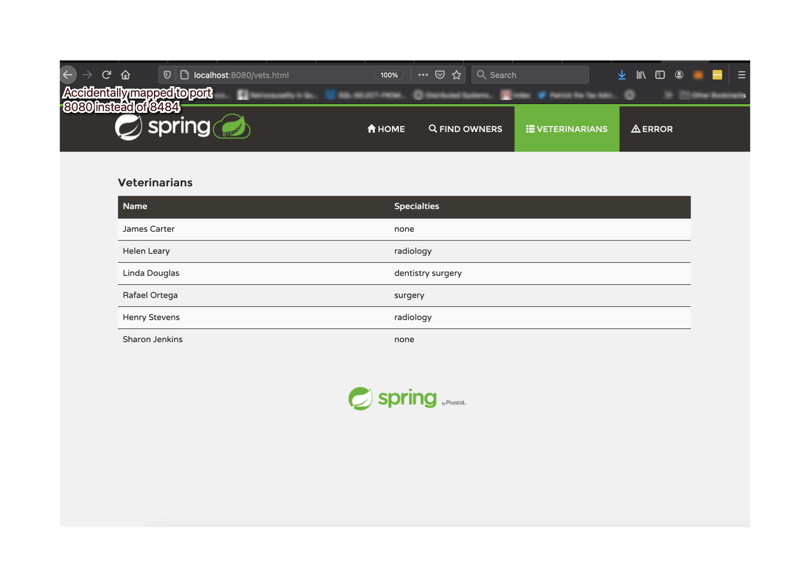

# Bryce Jensen 1980257
#
#
### 5 pts Your Github account showing that is has been forked from the depaulcdm/springpetclinic repository.
#

#
#
### 5 pts Your Travis CI dashboard showing a successful first build.
#

#
#
### 5 pts The section of the POM file showing the coordinates after you’ve changed them.
#

#
#
### 5 pts Your Travis CI dashboard showing a successful build after your change of the group ID.
#

#
#
### 5 pts The section of the POM file showing the coordinates after you’ve commented them out.
#

#
#
### 5 pts Your Travis CI dashboard showing the unsuccessful build after the breaking change.
#

#
#
### 5 pts Your Github repository with the readme.md file selected showing the build failed status after the Travis CI build fails.
#

#
#
### 5 pts The section of the POM file showing the coordinates after you’ve fixed them.
#

#
#
### 5 pts Your Travis CI dashboard showing the successful build after the breaking change has been fixed.
#

#
#
### 5 pts Your Github repository with the readme.md file selected showing the build success status after the Travis CI build has recovered.
#

#
#
#
# Docker || HW8
#

#
#
### Your dockerfile.  Please provide a link to this file rather than a screen capture.
#
https://github.com/bjensen5/spring-petclinic/blob/master/Dockerfile

#
#
### Your running docker instance as shown by a ps command.
#

#
#
### Your browser accessing the main page of the website from your local container.
#

#
#
## Docker Compose --mysql only
#
### The output from the docker-compose upcommand
# 

#
#
### Your browser accessing the “Veterinarians” page of the website from your local container when you run the application from the host system
# 

#
#
### A  section  of  the  stack  trace  generated  when  you  attempt  to  run  the  application container that has been updated to use MySQL
# 

#
#
## Docker Compose --both
#
### Your updated docker-compose.yml file containing the application server, built from your local Dockerfile, and the existing MySQL configuration.  Please provide a link to this file rather than a screen capture.
# 
https://github.com/bjensen5/spring-petclinic/blob/master/docker-compose.yml

#
#
### Your updated application-mysql.properties file containing the URL change for the database server.  Please provide a link to this file rather than a screen capture.
# 
https://github.com/bjensen5/spring-petclinic/blob/master/src/main/resources/application-mysql.properties

#
#
### The output from the docker-compose up command
# 

#
#
### Your browser accessing the “Veterinarians” page of the website from your local con-tainer.
#

